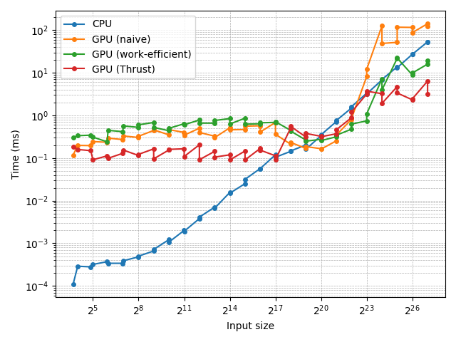

# CUDA Stream Compaction

**University of Pennsylvania, CIS 565: GPU Programming and Architecture, Project 2**

- Yunhao Qian
  - [LinkedIn](https://www.linkedin.com/in/yunhao-qian-026980170/)
  - [GitHub](https://github.com/yunhao-qian)
- Tested on:
  - OS: Windows 11, 24H2
  - CPU: 13th Gen Intel(R) Core(TM) i7-13700 (2.10 GHz)
  - GPU: NVIDIA GeForce RTX 4090
  - RAM: 32.0 GB

## Overview

### Features

This project implements stream compaction and its building blocks (map, scan, scatter) using multiple approaches. Key features include:

- A CPU implementation of scan and stream compaction
- GPU implementations of scan, using both naive and work-efficient methods
- A GPU implementation of stream compaction based on the work-efficient scan
- C++ and Python scripts used to automate performance measurement accurately and programmatically
- Performance analysis comparing the different methods

### Changes to `CMakeLists.txt`

An additional executable,`measure_time.exe`, has been added to the project to support block size tuning, performance benchmarking, and profiling.

### Changes to Function Signatures

To simplify block size tuning, I added an optional `blockSize` parameter to the following functions, each with a tuned default value:

- `Naive::scan(..., const int blockSize = 256)`
- `Efficient::scan(..., const int blockSize = 128)`
- `Efficient::compact(..., const int blockSize = 128)`

These parameters are used only by `measure_time.exe` and do not affect existing calls.

## Part 1: CPU Scan & Stream Compaction

In [`cpu.h`](stream_compaction/cpu.h) and [`cpu.cu`](stream_compaction/cpu.cu):

- `scan()`: Computes an exclusive prefix sum using a simple `for` loop.
- `compactWithoutScan()`: Performs stream compaction directly with a `for` loop, without calling `scan()`.
- `compactWithScan()`: Implements stream compaction using map → scan → scatter. While it follows the structure of a parallel implementation, it is built entirely with `for` loops.

## Part 2:  Naive GPU Scan Algorithm

In [`naive.h`](stream_compaction/naive.h) and [`naive.cu`](stream_compaction/naive.cu):

- `scan()`: Implements the naive algorithm from GPU Gems 3, Section 39.2.1, with the following differences:
  - Uses only global memory (does not leverage shared memory).
  - Launches one kernel per level, plus an additional kernel at the end to shift the results, rather than fusing the entire algorithm into a single kernel.

## Part 3: Work-Efficient GPU Scan & Stream Compaction

### 3.1. Scan

In [`efficient.h`](stream_compaction/efficient.h) and [`efficient.cu`](stream_compaction/efficient.cu):

- `scan()`: Implements the work-efficient algorithm from GPU Gems 3, Section 39.2.2, with the following differences:
  - Uses only global memory (does not leverage shared memory).
  - Launches one kernel per up-sweep/down-sweep level, rather than a single fused kernel.
  - Saves results in place instead of out-of-place.
- Added `scanImpl()`, which operates directly on device arrays. This avoids the CPU buffer interface exposed by `scan()`, making it easier to integrate with CUDA code.

### 3.2. Stream Compaction

In [`common.h`](stream_compaction/common.h) and [`common.cu`](stream_compaction/common.cu):

- `kernMapToBoolean()` A CUDA kernel that maps each integer to 0 or 1, depending on whether the value is zero.
- `kernScatter()`: A CUDA kernel that performs the scatter operation with vector addressing. Conditioned on a boolean array, it optionally stores elements at locations specified by an index array.

In [`efficient.h](stream_compaction/efficient.h) and [`efficient.cu`](stream_compaction/efficient.cu):

- `compact()`: Implements stream compaction on GPU using map (via `kernMapToBoolean()`) → scan (via `scanImpl()`) → scatter (via `kernScatter()`).

## Part 4: Using Thrust's Implementation

In [`thrust.h`](stream_compaction/thrust.h) and [`thrust.cu`](stream_compaction/thrust.cu):

- `scan()`: Wraps `thrust::exclusive_scan()`, adding timing instrumentation and exposing the same API as the other implementations.

## Part 5: Why is My GPU Approach So Slow?

I believe Part 3.1 already incorporates the optimizations described in the instructions:

- For an up-sweep or down-sweep level with a given `offset`, only elements at indices `j = (i + 1) * offset * 2 - 1`, where `i` is any integer and `0 ≤ j < n`, require processing. All other elements can be skipped.
- Instead of mapping each kernel thread to a `j`, we map each thread directly to an `i`. This ensures that nearly all launched threads perform useful work.
- As a result, fewer threads need to be launched. For a given `block_size`, the number of required blocks becomes
`ceil(n / (2 * offset * block_size))`.

## Part 6: Extra Credit

### Extra Credit 1: Radix Sort

This part is not implemented.

### Extra Credit 2: GPU Scan Using Shared Memory && Hardware Optimizatio

This part is not implemented.

## Part 7: Write-up

Project description: see the [Features](#features) section at the top.

### Performance Analysis

#### `measure_time.exe`

To simplify performance analysis, I added a C++ executable, `measure_time.exe`. The implementation is in [`measure_time.cpp`](src/measure_time.cpp), which:

- Accepts the operation (scan or compact), implementation (CPU, GPU naive, GPU work-efficient, or GPU Thrust), input size, and block size as command-line arguments.
- Generates random input data and prints the measured execution time (in milliseconds) to the console.

I created this tool because measuring a configuration only once is often imprecise. In my earlier attempts, running repeated measurements within a C++ loop caused the results to drift significantly. In particular, Thrust measurements became unexpectedly slower, sometimes even slower than the GPU naive implementation. I suspect this was due to frequent GPU memory allocations and deallocations (since the exposed API uses CPU inputs and outputs), which created an atypical workload and put the driver in a degraded performance state.

To avoid this issue, I designed `measure_time.exe` to test only a single configuration with one iteration per program launch. Repeated measurements are instead automated by accompanying Python scripts.

#### Optimizing Block Sizes

To optimize block sizes, I added an optional `blockSize` parameter to every top-level function, each with a tuned default value. This preserves backward compatibility while making block-size tuning easier.

I also added a new executable, `tune_block_sizes.exe`, to the CMake project. In [`tune_block_sizes.cpp`](src/tune_block_sizes.cpp), it searches for the optimal block size for each algorithm by:

- Using arrays of randomly generated test data. Since the optimal block size can vary significantly with input sizes, experiments are run on a fixed scale of $2^22$, with both power-of-two ($2^22$) and non-power-of-two $2^22 - 3$ sizes.
- Testing a log-spaced range of block sizes: 8, 16, …, 512, 1024.
- Measuring performance with precise timing: each configuration is warmed up with 10 runs, then measured over 100 runs, and the average elapsed GPU time is recorded.
- Reporting results and selecting the block size that balances performance across both power-of-two and non-power-of-two inputs.

Based on these experiments, the chosen defaults are:

- 256 for the naive scan
- 128 for the work-efficient scan and compaction

#### Performance Comparison



Methods:

- **Input sizes:** The figure above compares all scan implementations across a range of input sizes. I use pairs of input sizes $2^n$ and $2^n - 3$, and confirm that each pair shows similar performance, while power-of-two input sizes are sometimes marginally faster. The following discussion therefore considers only the range of data sizes, without distinguishing between power-of-two and non-power-of-two inputs.
- **Data collection:** To simplify data collection for this plot, I added `compare_performance.exe` to the CMake project. In [`compare_performance.cpp`](src/compare_performance.cpp), it measures the average execution time (1 warmup runs and 10 measured runs) for each configuration and writes the results to a newline-delimited JSON file ([`performance_comparison.nljson`](scripts/performance_comparison.nljson)). Then [`plot_performance_comparison.py`](scripts/plot_performance_comparison.py) reads the JSON data and generates the plot.
- **Plotting:** Because the input sizes are log-spaced and execution time grows rapidly for larger inputs, I used logarithmic scales on both axes of the plot.

### Observation and Analysis

- The CPU implementation has $O(N)$ complexity in theory, which is confirmed by the linear trend in the log-log plot. Interestingly, this simple, low-overhead method outperforms the GPU implementations (naive, work-efficient, and Thrust) across a fairly wide range of input sizes (up to about 300,000).
- My naive and work-efficient GPU implementations behave as follows:
  - They are not very sensitive to input size until $N$ becomes very large (around $10^6$). This is likely because launching kernels $O(\log N)$ times dominates execution time, while the amount of work per kernel remains relatively small.
  - Beyond $10^6$, the actual work performed inside each kernel becomes a larger portion of execution time, and execution time increases significantly with $N$.
- Comparing naive and work-efficient GPU implementations:
  - The naive method is faster when $N < 10^6$, again because of kernel launch overhead. Although work-efficient performs only $O(N)$ total work versus $O(N \log N)$, it requires both an up-sweep and a down-sweep, doubling the number of kernel launches.
  - For $N > 10^6$, the advantage of the work-efficient method becomes clear, and it outperforms the naive version.
- The Thrust library shows a different performance profile:
  - Plot observation: When $N < 10^5$, the Thrust implementation is significantly faster than my naive and work-efficient versions, though still slower than the CPU implementation. However, for larger $N$, Thrust unexpectedly runs slower than my global-memory–only work-efficient implementation.
  - Nsight Systems observation: Each call to `thrust::exclusive_scan()` generates only two kernels:
    - `DeviceScanInitKernel`, which is short-lived,
    - `DeviceScanKernel`, which dominates execution time.
  - Analysis:
    - For small $N$, execution time is dominated by kernel launch overhead. Since Thrust minimizes this to just two launches, it performs well in this regime.  
    - For large $N$, Thrust likely employs shared memory optimizations. The cause of its relative slowness compared to my implementation requires further investigation.

#### Outputs of `cis5650_stream_compaction_test.exe`

```text
****************
** SCAN TESTS **
****************
    [  16  35   8  21  46  26  19   0  42  43   9  45  49 ...  16   0 ]
==== cpu scan, power-of-two ====
   elapsed time: 1.6805ms    (std::chrono Measured)
    [   0  16  51  59  80 126 152 171 171 213 256 265 310 ... 102780293 102780309 ]
==== cpu scan, non-power-of-two ====
   elapsed time: 1.5015ms    (std::chrono Measured)
    [   0  16  51  59  80 126 152 171 171 213 256 265 310 ... 102780200 102780221 ]
    passed 
==== naive scan, power-of-two ====
   elapsed time: 0.376736ms    (CUDA Measured)
    passed 
==== naive scan, non-power-of-two ====
   elapsed time: 0.326432ms    (CUDA Measured)
    passed 
==== work-efficient scan, power-of-two ====
   elapsed time: 0.41936ms    (CUDA Measured)
    passed 
==== work-efficient scan, non-power-of-two ====
   elapsed time: 0.41024ms    (CUDA Measured)
    passed 
==== thrust scan, power-of-two ====
   elapsed time: 0.3416ms    (CUDA Measured)
    passed 
==== thrust scan, non-power-of-two ====
   elapsed time: 0.333088ms    (CUDA Measured)
    passed 

*****************************
** STREAM COMPACTION TESTS **
*****************************
    [   0   1   2   3   2   2   1   2   2   3   3   3   3 ...   2   0 ]
==== cpu compact without scan, power-of-two ====
   elapsed time: 7.3473ms    (std::chrono Measured)
    [   1   2   3   2   2   1   2   2   3   3   3   3   2 ...   3   2 ]
    passed 
==== cpu compact without scan, non-power-of-two ====
   elapsed time: 7.2214ms    (std::chrono Measured)
    [   1   2   3   2   2   1   2   2   3   3   3   3   2 ...   1   1 ]
    passed 
==== cpu compact with scan ====
   elapsed time: 14.0601ms    (std::chrono Measured)
    [   1   2   3   2   2   1   2   2   3   3   3   3   2 ...   3   2 ]
    passed 
==== work-efficient compact, power-of-two ====
   elapsed time: 0.431744ms    (CUDA Measured)
    passed 
==== work-efficient compact, non-power-of-two ====
   elapsed time: 0.576384ms    (CUDA Measured)
    passed 
Press any key to continue . . . 
```

#### Outputs of `tune_block_sizes.py`

```text
Naive scan, power-of-two
Block size: 8, time: 6.231833506 ms
Block size: 16, time: 3.173327995 ms
Block size: 32, time: 1.6745983839999998 ms
Block size: 64, time: 0.8986879886000001 ms
Block size: 128, time: 0.5220288008999999 ms
Block size: 256, time: 0.3854463994 ms
Block size: 512, time: 0.4322271972999999 ms
Block size: 1024, time: 0.4435839981 ms
Optimal block size: 256, time: 0.3854463994 ms
========================================
Naive scan, non-power-of-two
Block size: 8, time: 6.219187259 ms
Block size: 16, time: 3.18726716 ms
Block size: 32, time: 1.658544017 ms
Block size: 64, time: 0.8911647916 ms
Block size: 128, time: 0.5024224044000001 ms
Block size: 256, time: 0.3580832005 ms
Block size: 512, time: 0.3581887961 ms
Block size: 1024, time: 0.4385919958000001 ms
Optimal block size: 256, time: 0.3580832005 ms
========================================
Work-efficient scan, power-of-two
Block size: 8, time: 0.8682271958 ms
Block size: 16, time: 0.6581280051999999 ms
Block size: 32, time: 0.5843007983 ms
Block size: 64, time: 0.511523199 ms
Block size: 128, time: 0.47026240229999994 ms
Block size: 256, time: 0.5074463992 ms
Block size: 512, time: 0.48191359920000004 ms
Block size: 1024, time: 0.4813536018 ms
Optimal block size: 128, time: 0.47026240229999994 ms
========================================
Work-efficient scan, non-power-of-two
Block size: 8, time: 0.8395776093 ms
Block size: 16, time: 0.6402047992 ms
Block size: 32, time: 0.5541888057000001 ms
Block size: 64, time: 0.5040127992000001 ms
Block size: 128, time: 0.4989087999 ms
Block size: 256, time: 0.5251072078000001 ms
Block size: 512, time: 0.48322560189999997 ms
Block size: 1024, time: 0.49256000219999996 ms
Optimal block size: 512, time: 0.48322560189999997 ms
========================================
Work-efficient compact, power-of-two
Block size: 8, time: 1.4116608029999997 ms
Block size: 16, time: 0.9503391928000001 ms
Block size: 32, time: 0.7004479884 ms
Block size: 64, time: 0.5998431921 ms
Block size: 128, time: 0.5244000018 ms
Block size: 256, time: 0.5620128065000001 ms
Block size: 512, time: 0.7700480073 ms
Block size: 1024, time: 0.6348639965 ms
Optimal block size: 128, time: 0.5244000018 ms
========================================
Work-efficient compact, non-power-of-two
Block size: 8, time: 1.40685439 ms
Block size: 16, time: 0.9263231993 ms
Block size: 32, time: 0.7410848021000002 ms
Block size: 64, time: 0.7034976004999999 ms
Block size: 128, time: 0.7220223933 ms
Block size: 256, time: 0.7788672031 ms
Block size: 512, time: 0.7625663994 ms
Block size: 1024, time: 0.7747167944 ms
Optimal block size: 64, time: 0.7034976004999999 ms
```
