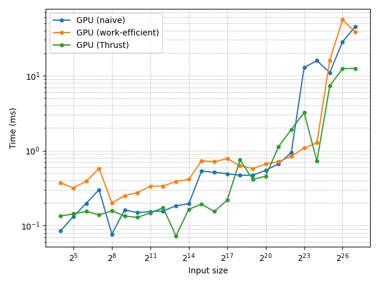

# CUDA Stream Compaction

**University of Pennsylvania, CIS 565: GPU Programming and Architecture, Project 2**

- Yunhao Qian
  - [LinkedIn](https://www.linkedin.com/in/yunhao-qian-026980170/)
  - [GitHub](https://github.com/yunhao-qian)
- Tested on:
  - OS: Windows 11, 24H2
  - CPU: 13th Gen Intel(R) Core(TM) i7-13700 (2.10 GHz)
  - GPU: NVIDIA GeForce RTX 4090
  - RAM: 32.0 GB

## Overview

### Features

This project implements stream compaction and its building blocks (map, scan, scatter) using multiple approaches. Key features include:

- A CPU implementation of scan and stream compaction
- GPU implementations of scan, using both naive and work-efficient methods
- A GPU implementation of stream compaction based on the work-efficient scan
- C++ and Python scripts used to automate performance measurement accurately and programmatically
- Performance analysis comparing the different methods

### Changes to `CMakeLists.txt`

An additional executable,`measure_time.exe`, has been added to the project to support block size tuning, performance benchmarking, and profiling.

### Changes to Function Signatures

To simplify block size tuning, I added an optional `blockSize` parameter to the following functions, each with a tuned default value:

- `Naive::scan(..., const int blockSize = 256)`
- `Efficient::scan(..., const int blockSize = 128)`
- `Efficient::compact(..., const int blockSize = 128)`

These parameters are used only by `measure_time.exe` and do not affect existing calls.

## Part 1: CPU Scan & Stream Compaction

In [`cpu.h`](stream_compaction/cpu.h) and [`cpu.cu`](stream_compaction/cpu.cu):

- `scan()`: Computes an exclusive prefix sum using a simple `for` loop.
- `compactWithoutScan()`: Performs stream compaction directly with a `for` loop, without calling `scan()`.
- `compactWithScan()`: Implements stream compaction using map → scan → scatter. While it follows the structure of a parallel implementation, it is built entirely with `for` loops.

## Part 2:  Naive GPU Scan Algorithm

In [`naive.h`](stream_compaction/naive.h) and [`naive.cu`](stream_compaction/naive.cu):

- `scan()`: Implements the naive algorithm from GPU Gems 3, Section 39.2.1, with the following differences:
  - Uses only global memory (does not leverage shared memory).
  - Launches one kernel per level, plus an additional kernel at the end to shift the results, rather than fusing the entire algorithm into a single kernel.

## Part 3: Work-Efficient GPU Scan & Stream Compaction

### 3.1. Scan

In [`efficient.h`](stream_compaction/efficient.h) and [`efficient.cu`](stream_compaction/efficient.cu):

- `scan()`: Implements the work-efficient algorithm from GPU Gems 3, Section 39.2.2, with the following differences:
  - Uses only global memory (does not leverage shared memory).
  - Launches one kernel per up-sweep/down-sweep level, rather than a single fused kernel.
  - Saves results in place instead of out-of-place.
- Added `scanImpl()`, which operates directly on device arrays. This avoids the CPU buffer interface exposed by `scan()`, making it easier to integrate with CUDA code.

### 3.2. Stream Compaction

In [`common.h`](stream_compaction/common.h) and [`common.cu`](stream_compaction/common.cu):

- `kernMapToBoolean()` A CUDA kernel that maps each integer to 0 or 1, depending on whether the value is zero.
- `kernScatter()`: A CUDA kernel that performs the scatter operation with vector addressing. Conditioned on a boolean array, it optionally stores elements at locations specified by an index array.

In [`efficient.h](stream_compaction/efficient.h) and [`efficient.cu`](stream_compaction/efficient.cu):

- `compact()`: Implements stream compaction on GPU using map (via `kernMapToBoolean()`) → scan (via `scanImpl()`) → scatter (via `kernScatter()`).

## Part 4: Using Thrust's Implementation

In [`thrust.h`](stream_compaction/thrust.h) and [`thrust.cu`](stream_compaction/thrust.cu):

- `scan()`: Wraps `thrust::exclusive_scan()`, adding timing instrumentation and exposing the same API as the other implementations.

## Part 5: Why is My GPU Approach So Slow?

I believe Part 3.1 already incorporates the optimizations described in the instructions:

- For an up-sweep or down-sweep level with a given `offset`, only elements at indices `j = (i + 1) * offset * 2 - 1`, where `i` is any integer and `0 ≤ j < n`, require processing. All other elements can be skipped.
- Instead of mapping each kernel thread to a `j`, we map each thread directly to an `i`. This ensures that nearly all launched threads perform useful work.
- As a result, fewer threads need to be launched. For a given `block_size`, the number of required blocks becomes
`ceil(n / (2 * offset * block_size))`.

## Part 6: Extra Credit

### Extra Credit 1: Radix Sort

This part is not implemented.

### Extra Credit 2: GPU Scan Using Shared Memory && Hardware Optimizatio

This part is not implemented.

## Part 7: Write-up

Project description: see the [Features](#features) section at the top.

### Performance Analysis

#### `measure_time.exe`

To simplify performance analysis, I added a C++ executable, `measure_time.exe`. The implementation is in [`measure_time.cpp`](src/measure_time.cpp), which:

- Accepts the operation (scan or compact), implementation (CPU, GPU naive, GPU work-efficient, or GPU Thrust), input size, and block size as command-line arguments.
- Generates random input data and prints the measured execution time (in milliseconds) to the console.

I created this tool because measuring a configuration only once is often imprecise. In my earlier attempts, running repeated measurements within a C++ loop caused the results to drift significantly. In particular, Thrust measurements became unexpectedly slower, sometimes even slower than the GPU naive implementation. I suspect this was due to frequent GPU memory allocations and deallocations (since the exposed API uses CPU inputs and outputs), which created an atypical workload and put the driver in a degraded performance state.

To avoid this issue, I designed `measure_time.exe` to test only a single configuration with one iteration per program launch. Repeated measurements are instead automated by accompanying Python scripts.

#### Optimizing Block Sizes

To optimize block sizes, I developed a Python script, [`tune_block_sizes.py`](scripts/tune_block_sizes.py). This script uses the previously described `measure_time.exe` to benchmark execution time across a range of block sizes and identify the configuration that minimizes runtime. Key details of the procedure are:

- Because optimal block sizes vary with input size, tests are conducted on a fixed scale of $2^{22}$, using both a power-of-two input ($2^{22}$) and a non-power-of-two input ($2^{22} - 3$).
- Block sizes are sampled over a log-spaced range: 8, 16, …, 512, 1024.
- Each configuration is executed 10 times, with the mean runtime recorded.
- The final selection balances performance across both power-of-two and non-power-of-two cases.

From these experiments, the chosen defaults are:

- 256 for the naive scan
- 128 for the work-efficient scan and compaction

#### Performance Comparison

To systematically collect execution time data across many configurations, I created a Python script, [`measure_performance.py`](scripts/measure_performance.py). This script relies on the previously described `measure_time.exe` to benchmark runtime across a range of input sizes and implementations. The procedure is as follows:

- Input sizes are tested from $2^4$ up to $2^{27}$, using both exact powers of two and non-powers of two ($2^i - 3$ for each $i$) to capture different performance behaviors.
- The tuned block sizes from earlier experiments are applied.
- Each configuration is executed 50 times, and the mean runtime is recorded.
- Results are stored in a JSON file ([`performance.json`](scripts/performance.json)).

The JSON data is then processed by another script, [`plot_performance.py`](scripts/plot_performance.py), which generates the figures shown in this report.

The first figure presents the full dataset:


Because non-power-of-two inputs produce jagged trends, and CPU performance scales on a very different range than GPU performance, a second figure was generated using only GPU data and power-of-two inputs:



### Observation and Analysis

#### CPU Implementation

The minimal for-loop CPU implementation consistently demonstrates $O(N)$ complexity across all tested input sizes, as confirmed by the linear trend in the log-log plot. This complexity holds regardless of whether the limiting factor is compute or memory. Regarding the bottleneck:

- The compute workload is very light, since addition operations are fast.
- The memory access pattern is highly favorable, as all reads and writes are sequential.

Although memory is typically slower than arithmetic operations—suggesting the implementation may be slightly memory-bound—the distinction is not critical here.

Importantly, this simple, low-overhead implementation outperforms the GPU variants (naive, work-efficient, and Thrust) for inputs up to about $2^{17}$. The likely reason is the absence of GPU kernel launch overhead, which allows the CPU to handle small and mid-sized inputs more efficiently.

#### Naive & Work-Efficient GPU Implementations

Common characteristics:

- For $N < 2^{20}$, both implementations show limited sensitivity to input size. In fact, runtime sometimes decreases as $N$ grows. This is likely because the $O(\log N)$ kernel launches dominate execution time, while the work per kernel remains relatively small. Additionally, the input sizes may be too small to fully utilize GPU resources. In this regime, the bottleneck is neither compute nor memory, but the overhead of repeated kernel launches.
- Beyond $2^{20}$, execution time increases rapidly with $N$, indicating saturation of a GPU resource. Given that both implementations rely heavily on global memory, the performance bottleneck is most likely memory I/O rather than computation.

Comparison of the two:

- For $N < 2^{21}$, the so-called work-efficient implementation is actually slower than the naive version. This can be attributed to kernel launch overhead: the up-sweep and down-sweep phases double the number of kernel invocations. Although the total work is reduced, the benefit is negligible at these smaller sizes.
- For larger $N$, the work-efficient method begins to outperform the naive implementation, and the gap widens quickly. This is because the work-efficient algorithm performs only $O(N)$ total operations, whereas the naive approach requires $O(N \log N)$.

#### Thrust GPU Implementation

To better understand the behavior of `thrust::exclusive_scan()`, I profiled it using Nsight Systems. The results revealed only two CUDA kernel calls:

- `DeviceScanInitKernel`, which is short-lived
- `DeviceScanKernel`, which dominates execution time

This suggests that Thrust fuses the entire scan into just two kernels. While the internal algorithm is not directly visible, it is reasonable to assume that it leverages shared memory and optimized memory access patterns.

The performance profile of Thrust’s `exclusive_scan` is notable:

- Small sizes ($N \leq 2^{17}$): Runtime remains relatively flat across input sizes. Although slower than the CPU implementation, it is still much faster than the naive and work-efficient GPU versions, likely due to the minimal number of kernel launches.
- Mid sizes ($2^{18} \leq N \leq 2^{23}$): Runtime unexpectedly spikes, at times even performing worse than the naive implementation. It seems unlikely that NVIDIA’s official library would be poorly optimized, especially since this anomaly does not appear for other people. I suspect the performance degradation is related to the measurement methodology: repeatedly allocating memory, copying data CPU → GPU, launching kernels, copying results GPU → CPU, and freeing memory. This atypical workflow may interact with the driver in unusual ways. This remains a hypothesis and warrants further investigation.
- Large sizes ($N > 2^{23}$): Thrust significantly outperforms the other implementations, presumably because its internal use of shared memory and optimized access patterns scales effectively at large input sizes.

#### Outputs of `cis5650_stream_compaction_test.exe`

```text
****************
** SCAN TESTS **
****************
    [  16  35   8  21  46  26  19   0  42  43   9  45  49 ...  16   0 ]
==== cpu scan, power-of-two ====
   elapsed time: 1.6805ms    (std::chrono Measured)
    [   0  16  51  59  80 126 152 171 171 213 256 265 310 ... 102780293 102780309 ]
==== cpu scan, non-power-of-two ====
   elapsed time: 1.5015ms    (std::chrono Measured)
    [   0  16  51  59  80 126 152 171 171 213 256 265 310 ... 102780200 102780221 ]
    passed
==== naive scan, power-of-two ====
   elapsed time: 0.376736ms    (CUDA Measured)
    passed
==== naive scan, non-power-of-two ====
   elapsed time: 0.326432ms    (CUDA Measured)
    passed
==== work-efficient scan, power-of-two ====
   elapsed time: 0.41936ms    (CUDA Measured)
    passed
==== work-efficient scan, non-power-of-two ====
   elapsed time: 0.41024ms    (CUDA Measured)
    passed
==== thrust scan, power-of-two ====
   elapsed time: 0.3416ms    (CUDA Measured)
    passed
==== thrust scan, non-power-of-two ====
   elapsed time: 0.333088ms    (CUDA Measured)
    passed

*****************************
** STREAM COMPACTION TESTS **
*****************************
    [   0   1   2   3   2   2   1   2   2   3   3   3   3 ...   2   0 ]
==== cpu compact without scan, power-of-two ====
   elapsed time: 7.3473ms    (std::chrono Measured)
    [   1   2   3   2   2   1   2   2   3   3   3   3   2 ...   3   2 ]
    passed
==== cpu compact without scan, non-power-of-two ====
   elapsed time: 7.2214ms    (std::chrono Measured)
    [   1   2   3   2   2   1   2   2   3   3   3   3   2 ...   1   1 ]
    passed
==== cpu compact with scan ====
   elapsed time: 14.0601ms    (std::chrono Measured)
    [   1   2   3   2   2   1   2   2   3   3   3   3   2 ...   3   2 ]
    passed
==== work-efficient compact, power-of-two ====
   elapsed time: 0.431744ms    (CUDA Measured)
    passed
==== work-efficient compact, non-power-of-two ====
   elapsed time: 0.576384ms    (CUDA Measured)
    passed
Press any key to continue . . .
```

#### Outputs of `tune_block_sizes.py`

```text
Naive scan, power-of-two
Block size: 8, time: 6.231833506 ms
Block size: 16, time: 3.173327995 ms
Block size: 32, time: 1.6745983839999998 ms
Block size: 64, time: 0.8986879886000001 ms
Block size: 128, time: 0.5220288008999999 ms
Block size: 256, time: 0.3854463994 ms
Block size: 512, time: 0.4322271972999999 ms
Block size: 1024, time: 0.4435839981 ms
Optimal block size: 256, time: 0.3854463994 ms
========================================
Naive scan, non-power-of-two
Block size: 8, time: 6.219187259 ms
Block size: 16, time: 3.18726716 ms
Block size: 32, time: 1.658544017 ms
Block size: 64, time: 0.8911647916 ms
Block size: 128, time: 0.5024224044000001 ms
Block size: 256, time: 0.3580832005 ms
Block size: 512, time: 0.3581887961 ms
Block size: 1024, time: 0.4385919958000001 ms
Optimal block size: 256, time: 0.3580832005 ms
========================================
Work-efficient scan, power-of-two
Block size: 8, time: 0.8682271958 ms
Block size: 16, time: 0.6581280051999999 ms
Block size: 32, time: 0.5843007983 ms
Block size: 64, time: 0.511523199 ms
Block size: 128, time: 0.47026240229999994 ms
Block size: 256, time: 0.5074463992 ms
Block size: 512, time: 0.48191359920000004 ms
Block size: 1024, time: 0.4813536018 ms
Optimal block size: 128, time: 0.47026240229999994 ms
========================================
Work-efficient scan, non-power-of-two
Block size: 8, time: 0.8395776093 ms
Block size: 16, time: 0.6402047992 ms
Block size: 32, time: 0.5541888057000001 ms
Block size: 64, time: 0.5040127992000001 ms
Block size: 128, time: 0.4989087999 ms
Block size: 256, time: 0.5251072078000001 ms
Block size: 512, time: 0.48322560189999997 ms
Block size: 1024, time: 0.49256000219999996 ms
Optimal block size: 512, time: 0.48322560189999997 ms
========================================
Work-efficient compact, power-of-two
Block size: 8, time: 1.4116608029999997 ms
Block size: 16, time: 0.9503391928000001 ms
Block size: 32, time: 0.7004479884 ms
Block size: 64, time: 0.5998431921 ms
Block size: 128, time: 0.5244000018 ms
Block size: 256, time: 0.5620128065000001 ms
Block size: 512, time: 0.7700480073 ms
Block size: 1024, time: 0.6348639965 ms
Optimal block size: 128, time: 0.5244000018 ms
========================================
Work-efficient compact, non-power-of-two
Block size: 8, time: 1.40685439 ms
Block size: 16, time: 0.9263231993 ms
Block size: 32, time: 0.7410848021000002 ms
Block size: 64, time: 0.7034976004999999 ms
Block size: 128, time: 0.7220223933 ms
Block size: 256, time: 0.7788672031 ms
Block size: 512, time: 0.7625663994 ms
Block size: 1024, time: 0.7747167944 ms
Optimal block size: 64, time: 0.7034976004999999 ms
```
