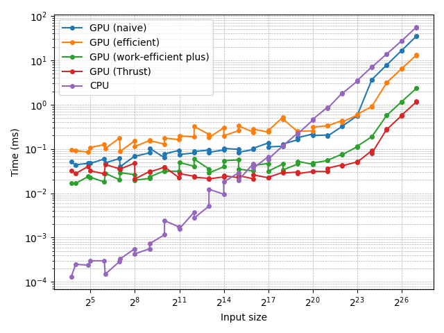

# CUDA Stream Compaction

**University of Pennsylvania, CIS 565: GPU Programming and Architecture, Project 2**

- Yunhao Qian
  - [LinkedIn](https://www.linkedin.com/in/yunhao-qian-026980170/)
  - [GitHub](https://github.com/yunhao-qian)
- Tested on:
  - OS: Windows 11, 24H2
  - CPU: 13th Gen Intel(R) Core(TM) i7-13700 (2.10 GHz)
  - GPU: NVIDIA GeForce RTX 4090
  - RAM: 32.0 GB

## Overview

### Features

This project implements stream compaction and its building blocks (map, scan, scatter) using multiple approaches. Key features include:

- A CPU implementation of scan and stream compaction
- GPU implementations of scan, using both naive and work-efficient methods
- A GPU implementation of stream compaction based on the work-efficient scan
- A carefully optimized work-efficient scan that leverages shared memory along with several additional optimizations
- C++ and Python scripts used to automate performance measurement accurately and programmatically
- Performance analysis comparing the different methods
- More in-depth performance analysis conducted with Nsight

### Changes to `CMakeLists.txt`

- An additional executable,`measure_time.exe`, has been added to the project to support block size tuning, performance benchmarking, and profiling.
- The files `cpu_sort.h`, `cpu_sort.cu`, `radix_sort.h`, `radix_sort.h` were introduced to implement Extra Credit 1.
- The files `efficient_plus.h` and `efficient_plus.cu` were introduced to implement Extra Credit 2.

### Function Overloads

To make block size tuning easier, I added overloads of the following functions that accept an additional `blockSize` parameter. The original overloads remain unchanged and simply forward to the new versions with a tuned default value:

- `Naive::scan(..., const int blockSize)`
- `Efficient::scan(..., const int blockSize)`
- `Efficient::compact(..., const int blockSize)`

These changes are only used by `measure_time.exe` and do not affect existing code paths.

## Part 1: CPU Scan & Stream Compaction

In [`cpu.h`](stream_compaction/cpu.h) and [`cpu.cu`](stream_compaction/cpu.cu):

- `scan()`: Computes an exclusive prefix sum using a simple `for` loop.
- `compactWithoutScan()`: Performs stream compaction directly with a `for` loop, without calling `scan()`.
- `compactWithScan()`: Implements stream compaction using map → scan → scatter. While it follows the structure of a parallel implementation, it is built entirely with `for` loops.

## Part 2:  Naive GPU Scan Algorithm

In [`naive.h`](stream_compaction/naive.h) and [`naive.cu`](stream_compaction/naive.cu):

- `scan()`: Implements the naive algorithm from GPU Gems 3, Section 39.2.1, with the following differences:
  - Uses only global memory (does not leverage shared memory).
  - Launches one kernel per level, plus an additional kernel at the end to shift the results, rather than fusing the entire algorithm into a single kernel.

## Part 3: Work-Efficient GPU Scan & Stream Compaction

### 3.1. Scan

In [`efficient.h`](stream_compaction/efficient.h) and [`efficient.cu`](stream_compaction/efficient.cu):

- `scan()`: Implements the work-efficient algorithm from GPU Gems 3, Section 39.2.2, with the following differences:
  - Uses only global memory (does not leverage shared memory).
  - Launches one kernel per up-sweep/down-sweep level, rather than a single fused kernel.
  - Saves results in place instead of out-of-place.
- Added `scanImpl()`, which operates directly on device arrays. This avoids the CPU buffer interface exposed by `scan()`, making it easier to integrate with CUDA code.

### 3.2. Stream Compaction

In [`common.h`](stream_compaction/common.h) and [`common.cu`](stream_compaction/common.cu):

- `kernMapToBoolean()` A CUDA kernel that maps each integer to 0 or 1, depending on whether the value is zero.
- `kernScatter()`: A CUDA kernel that performs the scatter operation with vector addressing. Conditioned on a boolean array, it optionally stores elements at locations specified by an index array.

In [`efficient.h`](stream_compaction/efficient.h) and [`efficient.cu`](stream_compaction/efficient.cu):

- `compact()`: Implements stream compaction on GPU using map (via `kernMapToBoolean()`) → scan (via `scanImpl()`) → scatter (via `kernScatter()`).

## Part 4: Using Thrust's Implementation

In [`thrust.h`](stream_compaction/thrust.h) and [`thrust.cu`](stream_compaction/thrust.cu):

- `scan()`: Wraps `thrust::exclusive_scan()`, adding timing instrumentation and exposing the same API as the other implementations.
- Profiling revealed that beyond a certain input size, `thrust::exclusive_scan()` switches to an algorithm that allocates GPU memory internally. These allocations introduced significant variability in benchmarking, at times making Thrust appear slower than even the naive implementation. To address this, I created a reusable memory pool and invoked the overload of `exclusive_scan` that accepts an execution policy configured with that pool. This allows the benchmark to perform a warm-up run (which handles any necessary allocations) and then time the second run, which reuses the existing memory without additional allocations.

## Part 5: Why is My GPU Approach So Slow?

I believe Part 3.1 already incorporates the optimizations described in the instructions:

- For an up-sweep or down-sweep level with a given `offset`, only elements at indices `j = (i + 1) * offset * 2 - 1`, where `i` is any integer and `0 ≤ j < n`, require processing. All other elements can be skipped.
- Instead of mapping each kernel thread to a `j`, we map each thread directly to an `i`. This ensures that nearly all launched threads perform useful work.
- As a result, fewer threads need to be launched. For a given `block_size`, the number of required blocks becomes
`ceil(n / (2 * offset * block_size))`.

## Part 6: Extra Credit

### Extra Credit 1: Radix Sort

Radix sort is implemented in `radix_sort.cu`. It uses the `efficient_plus.cu` scan developed for extra credit 2, along with several other utility kernels. The algorithm processes the input data one bit at a time, from the least significant to the most significant.

For each bit, the process is as follows:

1. Extract Bits: The specific bit is extracted from each integer.
2. Scan for Indices: A parallel scan is performed on these extracted bits to determine the correct destination index for each element.
3. Count Deduction: The last element of the scanned output and the last element of the input are used to quickly deduce the counts of both zeros and ones.
4. Stable Scatter: A stable scatter operation then moves the elements to their new, sorted positions based on the calculated indices, preserving the relative order of elements with the same bit value.

After iterating through all the bits, the data is fully sorted. The correctness of the GPU implementation is verified in `main.cpp` by comparing its output against a baseline CPU sorting algorithm implemented in `cpu_sort.cu`. The results confirm that the implementation is accurate.

### Extra Credit 2: GPU Scan Using Shared Memory && Hardware Optimization

To improve the work-efficient implementation, I developed the work-efficient plus variant in [`efficient_plus.h`](stream_compaction/efficient_plus.h) and [`efficient_plus.cu`](stream_compaction/efficient_plus.cu). Key aspects of this design include:

- Kernel fusing: The up-sweep and down-sweep phases are fused into a single kernel invocation. Although compacting indices no longer reduces the number of blocks, this approach minimizes divergence and is therefore retained.
- Shared memory usage: Instead of operating directly on global memory, data is first copied into shared memory, scanned per block, and then copied back to global memory.
- Recursive tiling: Since a block can only process a limited number of elements, the algorithm is made recursive.
  - The array is partitioned into tiles, one per block.
  - In addition to performing the scan, each block writes its tile sum into a new array.
  - An exclusive scan is recursively applied to this array of tile sums, and the results are then added back to the input data.
- Avoiding shared memory bank conflicts: Shared memory indexing is padded following the method described in GPU Gems. This introduces only a small increase in memory usage.
- Preallocating the recursion buffer: To avoid repeated allocation of temporary GPU buffers for tile sums, the recursion depth and total required storage are precomputed. A single contiguous GPU buffer is allocated and reused across all recursion levels.
- Multiple elements per thread: As an experiment, I added support for processing multiple elements per thread, controlled by the compile-time template parameter `ElementsPerThread`. Different variants are dispatched at runtime, and loops over per-thread elements are unrolled with `#pragma unroll`. In practice, this optimization was not beneficial; the tuned configuration still uses one element per thread.
- Shrinking block size in the final recursion: In the last recursion step, the input is often much smaller than the predefined block size. As a niche optimization, the block size can be reduced to the smallest power of two that accommodates the input, with shared memory usage adjusted accordingly. However, testing showed no measurable performance improvement from this change.

## Part 7: Write-up

Project description: see the [Features](#features) section at the top.

### Performance Analysis

#### `measure_time.exe`

To simplify performance analysis, I added a C++ executable, `measure_time.exe`. The implementation is in [`measure_time.cpp`](src/measure_time.cpp), which:

- Accepts the operation (scan or compact), implementation (CPU, GPU naive, GPU work-efficient, or GPU Thrust), input size, block size, and number of elements per thread as command-line arguments.
- Generates random input data and prints the measured execution time (in milliseconds) to the console.

I created this tool because measuring a configuration only once is often imprecise. In my earlier attempts, running repeated measurements within a C++ loop caused the results to drift significantly. In particular, Thrust measurements became unexpectedly slower, sometimes even slower than the GPU naive implementation. I suspect this was due to frequent GPU memory allocations and deallocations (since the exposed API uses CPU inputs and outputs), which created an atypical workload and put the driver in a degraded performance state.

To avoid this issue, I designed `measure_time.exe` to test only a single configuration with one iteration per program launch. Repeated measurements are instead automated by accompanying Python scripts.

#### Optimizing Parameters

To optimize parameters such as block sizes and the number of elements per thread, I created a Python script, [`tune_parameters.py`](scripts/tune_parameters.py).

- Because optimal block sizes vary with input size, tests are conducted on a fixed scale of $2^{22}$, using both a power-of-two input ($2^{22}$) and a non-power-of-two input ($2^{22} - 3$). The results indicate that the distinction between power-of-two and non-power-of-two input sizes has minimal impact on performance. Therefore, this factor will not be considered further in the discussion.
- Block sizes are sampled over a log-spaced range: 8, 16, …, 512, 1024.
- The number of processed elements per thread is one of 1, 2, 4, 8, and 16.
- Each configuration is executed 10 times, with the mean runtime recorded.
- The final selection balances performance across both power-of-two and non-power-of-two cases.

From these experiments, the chosen defaults are:

- Block size 256 for the naive scan
- Block size 64 for the work-efficient scan and compaction
- Block size 256 for the work-efficient plus (extra credit 2) scan, with 1 element per thread

#### Performance Comparison

To systematically collect execution time data across many configurations, I created a Python script, [`measure_performance.py`](scripts/measure_performance.py). This script relies on the previously described `measure_time.exe` to benchmark runtime across a range of input sizes and implementations. The procedure is as follows:

- Input sizes are tested from $2^4$ up to $2^{27}$, using both exact powers of two and non-powers of two ($2^i - 3$ for each $i$) to capture different performance behaviors.
- The number of elements processed per thread is selected from the set `{1, 2, 4, 8, 16}`.
- Each configuration is executed 10 times, and the mean runtime is recorded.
- Results are stored in a JSON file ([`performance.json`](scripts/performance.json)).

The JSON data is then processed by another script, [`plot_performance.py`](scripts/plot_performance.py), which generates the figures shown in this report.

The first figure presents the full dataset:



Because non-power-of-two inputs produce jagged trends, and CPU performance scales on a very different range than GPU performance, a second figure was generated using only GPU data and power-of-two inputs:


### Observation and Analysis

#### CPU Implementation

The minimal for-loop CPU implementation consistently demonstrates $O(N)$ complexity across all tested input sizes, as confirmed by the linear trend in the log-log plot. This complexity holds regardless of whether the limiting factor is compute or memory. Regarding the bottleneck:

- The compute workload is very light, since addition operations are fast.
- The memory access pattern is highly favorable, as all reads and writes are sequential.

Although memory is typically slower than arithmetic operations—suggesting the implementation may be slightly memory-bound—the distinction is not critical here.

Importantly, this simple, low-overhead implementation outperforms the GPU variants (naive, work-efficient, and Thrust) for inputs up to about $2^{17}$. The likely reason is the absence of GPU kernel launch overhead, which allows the CPU to handle small and mid-sized inputs more efficiently.

#### Naive & Work-Efficient GPU Implementations

Common characteristics:

- For $N < 2^{20}$, both implementations show limited sensitivity to input size. This is likely because the $O(\log N)$ kernel launches dominate execution time, while the work per kernel remains relatively small. Additionally, the input sizes may be too small to fully utilize GPU resources. In this regime, the bottleneck is neither compute nor memory, but the overhead of repeated kernel launches.
- Beyond $2^{20}$, execution time increases rapidly with $N$, indicating saturation of a GPU resource. Given that both implementations rely heavily on global memory, the performance bottleneck is most likely memory I/O rather than computation.

Comparison of the two:

- For $N < 2^{23}$, the so-called work-efficient implementation is actually slower than the naive version. This can be attributed to kernel launch overhead: the up-sweep and down-sweep phases double the number of kernel invocations. Although the total work is reduced, the benefit is negligible at these smaller sizes.
- For larger $N$, the work-efficient method begins to outperform the naive implementation, and the gap widens quickly. This is because the work-efficient algorithm performs only $O(N)$ total operations, whereas the naive approach requires $O(N \log N)$.

#### Work-Efficient Plus GPU Implementation (Extra Credit 2)

- Outperforms both the naive and work-efficient versions even for very small $N$, likely due to requiring fewer kernel launches.
- For larger inputs, achieves nearly an order of magnitude speedup over the previous two approaches, primarily from reduced global memory traffic and greater reliance on shared memory.
- Despite these gains, Nsight analysis later shows that the implementation remains memory-bound.


From the Nsight Systems timeline, execution begins with three `scanPerBlock` calls followed by three `addSums`. In the second and third recursion levels, the input size is so small that their runtimes are negligible. Nearly all of the execution time is spent in the first recursion level.


In Nsight Compute, examining the first recursion’s `scanPerBlock` shows a moderate SM throughput of about 53%. The kernel is clearly memory-bound, with memory and DRAM throughput reaching 92%, indicating that global memory reads and writes still dominate execution time.

In contrast, the first recursion's `addSums` achieves only 8% SM throughput, demonstrating that its performance is heavily constrained by global memory access. Under the current implementation, this behavior is expected and difficult to improve further without a major overhaul.

#### Thrust GPU Implementation

Thrust’s `exclusive_scan()` delivers strong performance across all input sizes:

- For small $N$, the runtime is comparable to the optimized work-efficient plus implementation.
- For large $N$, Thrust is roughly 2x faster. However, it is essential to warm up once before timing, so that internal GPU buffer allocations are excluded; otherwise, the runtime exhibits a sudden step increase after roughly $N = 2^{19}$.


From the timeline in Nsight Systems, execution begins with a lightweight `DeviceScanInitKernel`, followed by a single `DeviceScanKernel` that dominates the runtime. It is notable that the main computation is handled almost entirely within a single kernel launch.


In Nsight Compute, the `DeviceScanKernel` shows an SM throughput of 19%, lower than that of my work-efficient plus implementation, while memory and DRAM throughput remain similarly high at 93%. The high memory throughput reflects the inherent nature of the task. The lower SM throughput does not imply that Thrust’s implementation is less efficient. On the contrary, it likely reduces the total amount of computation through careful optimizations, with the lower SM utilization being a byproduct of that efficiency.

#### Outputs of `cis5650_stream_compaction_test.exe`

```text
****************
** SCAN TESTS **
****************
    [  13  35   9   0  27   0   9  16  22   8  47  34  47 ...  12   0 ]
==== cpu scan, power-of-two ====
   elapsed time: 1.5831ms    (std::chrono Measured)
    [   0  13  48  57  57  84  84  93 109 131 139 186 220 ... 102754952 102754964 ]
==== cpu scan, non-power-of-two ====
   elapsed time: 1.4894ms    (std::chrono Measured)
    [   0  13  48  57  57  84  84  93 109 131 139 186 220 ... 102754881 102754896 ]
    passed
==== naive scan, power-of-two ====
   elapsed time: 0.499936ms    (CUDA Measured)
    passed
==== naive scan, non-power-of-two ====
   elapsed time: 0.336768ms    (CUDA Measured)
    passed
==== work-efficient scan, power-of-two ====
   elapsed time: 0.865184ms    (CUDA Measured)
    passed
==== work-efficient scan, non-power-of-two ====
   elapsed time: 0.569664ms    (CUDA Measured)
    passed
==== work-efficient plus scan, power-of-two ====
   elapsed time: 0.472736ms    (CUDA Measured)
    passed
==== work-efficient plus scan, non-power-of-two ====
   elapsed time: 0.07552ms    (CUDA Measured)
    passed
==== thrust scan, power-of-two ====
   elapsed time: 0.277952ms    (CUDA Measured)
    passed
==== thrust scan, non-power-of-two ====
   elapsed time: 0.04608ms    (CUDA Measured)
    passed

*****************************
** STREAM COMPACTION TESTS **
*****************************
    [   1   3   1   0   1   0   1   0   0   0   1   0   1 ...   0   0 ]
==== cpu compact without scan, power-of-two ====
   elapsed time: 8.2601ms    (std::chrono Measured)
    [   1   3   1   1   1   1   1   3   2   2   3   2   2 ...   1   2 ]
    passed
==== cpu compact without scan, non-power-of-two ====
   elapsed time: 8.5801ms    (std::chrono Measured)
    [   1   3   1   1   1   1   1   3   2   2   3   2   2 ...   1   2 ]
    passed
==== cpu compact with scan ====
   elapsed time: 14.8527ms    (std::chrono Measured)
    [   1   3   1   1   1   1   1   3   2   2   3   2   2 ...   1   2 ]
    passed
==== work-efficient compact, power-of-two ====
   elapsed time: 0.495744ms    (CUDA Measured)
    passed
==== work-efficient compact, non-power-of-two ====
   elapsed time: 0.53136ms    (CUDA Measured)
    passed

*******************
** SORTING TESTS **
*******************
    [ 4113 24235 21309 2900 15577 2400 30009 8016 29272 30408 23697 20184 22097 ... 4812   0 ]
==== cpu sort, power-of-two ====
   elapsed time: 189.038ms    (std::chrono Measured)
==== gpu radix sort, power-of-two ====
   elapsed time: 3.96045ms    (CUDA Measured)
    passed
==== cpu sort, non-power-of-two ====
   elapsed time: 191.916ms    (std::chrono Measured)
==== gpu radix sort, non-power-of-two ====
   elapsed time: 4.00803ms    (CUDA Measured)
    passed
```

#### Outputs of `tune_parameters.py`

```text
Naive scan, power-of-two
Block size: 8, time: 6.1931840430000005 ms
Block size: 16, time: 3.160015989 ms
Block size: 32, time: 1.6289984100000001 ms
Block size: 64, time: 0.8754815995000002 ms
Block size: 128, time: 0.5630367994000001 ms
Block size: 256, time: 0.5268575905 ms
Block size: 512, time: 0.5707488000000001 ms
Block size: 1024, time: 0.4913184017000001 ms
Optimal block size: 1024, time: 0.4913184017000001 ms
========================================
Naive scan, non-power-of-two
Block size: 8, time: 6.197379209 ms
Block size: 16, time: 3.1488416440000004 ms
Block size: 32, time: 1.6155263910000002 ms
Block size: 64, time: 0.8565600038000001 ms
Block size: 128, time: 0.5647936076 ms
Block size: 256, time: 0.45924159600000003 ms
Block size: 512, time: 0.5508479952 ms
Block size: 1024, time: 0.4998720078999999 ms
Optimal block size: 256, time: 0.45924159600000003 ms
========================================
Work-efficient scan, power-of-two
Block size: 8, time: 1.2334048075 ms
Block size: 16, time: 0.9746495964999999 ms
Block size: 32, time: 1.0865504112999997 ms
Block size: 64, time: 0.7621375807999999 ms
Block size: 128, time: 0.8848479986000001 ms
Block size: 256, time: 0.7751007915 ms
Block size: 512, time: 1.2780031998999999 ms
Block size: 1024, time: 0.9169344123000001 ms
Optimal block size: 64, time: 0.7621375807999999 ms
========================================
Work-efficient scan, non-power-of-two
Block size: 8, time: 1.6846079939999998 ms
Block size: 16, time: 1.1247648052 ms
Block size: 32, time: 0.9946559961999999 ms
Block size: 64, time: 1.1106271928 ms
Block size: 128, time: 0.7899712115 ms
Block size: 256, time: 0.8548672105999999 ms
Block size: 512, time: 0.8211200056000001 ms
Block size: 1024, time: 0.3766912013 ms
Optimal block size: 1024, time: 0.3766912013 ms
========================================
Work-efficient compact, power-of-two
Block size: 8, time: 1.320752002 ms
Block size: 16, time: 0.9775711956 ms
Block size: 32, time: 0.9180895992 ms
Block size: 64, time: 1.2212512094 ms
Block size: 128, time: 0.8028352011 ms
Block size: 256, time: 1.337366404 ms
Block size: 512, time: 1.0536224006 ms
Block size: 1024, time: 0.9021439969000001 ms
Optimal block size: 128, time: 0.8028352011 ms
========================================
Work-efficient compact, non-power-of-two
Block size: 8, time: 1.819353578 ms
Block size: 16, time: 1.3313984046000003 ms
Block size: 32, time: 1.2955423931000003 ms
Block size: 64, time: 1.0542688068000001 ms
Block size: 128, time: 1.2601408064000004 ms
Block size: 256, time: 1.2192768095 ms
Block size: 512, time: 1.1920671929000002 ms
Block size: 1024, time: 1.3155871931 ms
Optimal block size: 64, time: 1.0542688068000001 ms
========================================
Work-efficient plus scan, power-of-two
Block size: 8, elements per thread: 1, time: 0.35677120390000006 ms
Block size: 8, elements per thread: 2, time: 0.2461855993 ms
Block size: 8, elements per thread: 4, time: 0.20586879839999997 ms
Block size: 8, elements per thread: 8, time: 0.2564895988 ms
Block size: 8, elements per thread: 16, time: 0.29693120419999997 ms
Block size: 16, elements per thread: 1, time: 0.2679104015 ms
Block size: 16, elements per thread: 2, time: 0.152214399 ms
Block size: 16, elements per thread: 4, time: 0.199580802 ms
Block size: 16, elements per thread: 8, time: 0.2125504002 ms
Block size: 16, elements per thread: 16, time: 0.2828671993 ms
Block size: 32, elements per thread: 1, time: 0.16852159649999998 ms
Block size: 32, elements per thread: 2, time: 0.1681056015 ms
Block size: 32, elements per thread: 4, time: 0.1758399994 ms
Block size: 32, elements per thread: 8, time: 0.21814079869999997 ms
Block size: 32, elements per thread: 16, time: 0.3729472012 ms
Block size: 64, elements per thread: 1, time: 0.16515839977999996 ms
Block size: 64, elements per thread: 2, time: 0.15373440083 ms
Block size: 64, elements per thread: 4, time: 0.1847008006 ms
Block size: 64, elements per thread: 8, time: 0.22609280039999996 ms
Block size: 64, elements per thread: 16, time: 0.3613759995 ms
Block size: 128, elements per thread: 1, time: 0.13827199933000003 ms
Block size: 128, elements per thread: 2, time: 0.12009920111999998 ms
Block size: 128, elements per thread: 4, time: 0.23142399940000002 ms
Block size: 128, elements per thread: 8, time: 0.2426623969 ms
Block size: 128, elements per thread: 16, time: 0.3689568042 ms
Block size: 256, elements per thread: 1, time: 0.1315040014 ms
Block size: 256, elements per thread: 2, time: 0.14512320169999998 ms
Block size: 256, elements per thread: 4, time: 0.1842624008 ms
Block size: 256, elements per thread: 8, time: 0.24464000160000002 ms
Block size: 256, elements per thread: 16, time: 0.36462400240000004 ms
Block size: 512, elements per thread: 1, time: 0.14869759980000002 ms
Block size: 512, elements per thread: 2, time: 0.1295744002 ms
Block size: 512, elements per thread: 4, time: 0.19439359899999997 ms
Block size: 512, elements per thread: 8, time: 0.2625504031 ms
Block size: 512, elements per thread: 16 - crashed
Block size: 1024, elements per thread: 1, time: 0.12309759919999999 ms
Block size: 1024, elements per thread: 2, time: 0.1486623989 ms
Block size: 1024, elements per thread: 4, time: 0.2266975983 ms
Block size: 1024, elements per thread: 8 - crashed
Block size: 1024, elements per thread: 16 - crashed
Optimal config: block size 128, elements per thread 2, time: 0.12009920111999998 ms
========================================
Work-efficient plus scan, non-power-of-two
Block size: 8, elements per thread: 1, time: 0.3583456037 ms
Block size: 8, elements per thread: 2, time: 0.25230080190000004 ms
Block size: 8, elements per thread: 4, time: 0.21565439989999996 ms
Block size: 8, elements per thread: 8, time: 0.24966079579999997 ms
Block size: 8, elements per thread: 16, time: 0.29572479430000004 ms
Block size: 16, elements per thread: 1, time: 0.2169760003 ms
Block size: 16, elements per thread: 2, time: 0.1610751987 ms
Block size: 16, elements per thread: 4, time: 0.1980544014 ms
Block size: 16, elements per thread: 8, time: 0.21126080009999998 ms
Block size: 16, elements per thread: 16, time: 0.2852992027 ms
Block size: 32, elements per thread: 1, time: 0.1461216008 ms
Block size: 32, elements per thread: 2, time: 0.15881919949999998 ms
Block size: 32, elements per thread: 4, time: 0.1823200002 ms
Block size: 32, elements per thread: 8, time: 0.2195231989 ms
Block size: 32, elements per thread: 16, time: 0.376639995 ms
Block size: 64, elements per thread: 1, time: 0.15102400022 ms
Block size: 64, elements per thread: 2, time: 0.13811200266 ms
Block size: 64, elements per thread: 4, time: 0.1730176017 ms
Block size: 64, elements per thread: 8, time: 0.217846398 ms
Block size: 64, elements per thread: 16, time: 0.3569279999 ms
Block size: 128, elements per thread: 1, time: 0.14728640024 ms
Block size: 128, elements per thread: 2, time: 0.13456960240000002 ms
Block size: 128, elements per thread: 4, time: 0.1838400023 ms
Block size: 128, elements per thread: 8, time: 0.2354975983 ms
Block size: 128, elements per thread: 16, time: 0.35950399940000005 ms
Block size: 256, elements per thread: 1, time: 0.11884800039000001 ms
Block size: 256, elements per thread: 2, time: 0.12683519940000001 ms
Block size: 256, elements per thread: 4, time: 0.1796159998 ms
Block size: 256, elements per thread: 8, time: 0.2481792004 ms
Block size: 256, elements per thread: 16, time: 0.3609760016 ms
Block size: 512, elements per thread: 1, time: 0.11134720002000001 ms
Block size: 512, elements per thread: 2, time: 0.11812160169 ms
Block size: 512, elements per thread: 4, time: 0.2151135998 ms
Block size: 512, elements per thread: 8, time: 0.258998403 ms
Block size: 512, elements per thread: 16 - crashed
Block size: 1024, elements per thread: 1, time: 0.11879039996999999 ms
Block size: 1024, elements per thread: 2, time: 0.15765759950000002 ms
Block size: 1024, elements per thread: 4, time: 0.22839040019999998 ms
Block size: 1024, elements per thread: 8 - crashed
Block size: 1024, elements per thread: 16 - crashed
Optimal config: block size 512, elements per thread 1, time: 0.11134720002000001 ms
```
